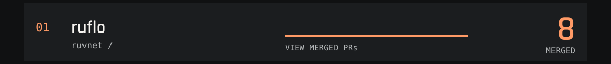
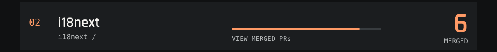
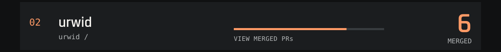
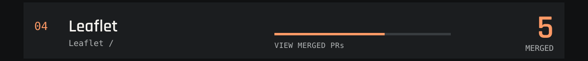
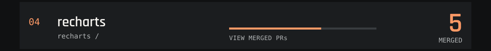
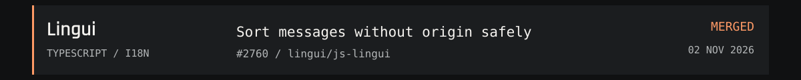
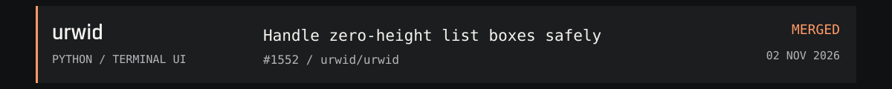
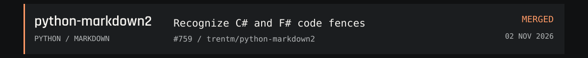
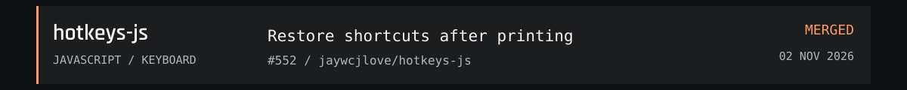

<picture>
  <source media="(prefers-reduced-motion: reduce) and (max-width: 600px)" srcset="./assets/hero-mobile-static.svg">
  <source media="(prefers-reduced-motion: reduce)" srcset="./assets/hero-static.svg">
  <source media="(max-width: 600px)" srcset="./assets/hero-mobile.svg">
  
</picture>

I'm Batman21, an indie developer working across languages and tools. I build useful open-source software, fix the rough edges, and share what I learn.

Part of team NewKing, a small crew of indie developers who also queue League of Legends.

<picture>
  <source media="(prefers-reduced-motion: reduce) and (max-width: 600px)" srcset="./assets/contributions-mobile-static.svg">
  <source media="(prefers-reduced-motion: reduce)" srcset="./assets/contributions-static.svg">
  <source media="(max-width: 600px)" srcset="./assets/contributions-mobile.svg">
  
</picture>

Public PRs to repos not owned by this account. All-time snapshot: <strong>2026-11-02</strong>. Repo count includes merged work.

### Where I contribute most

<a href="https://github.com/ruvnet/ruflo/pulls?q=is%3Apr%20is%3Amerged%20author%3Ank-batman21"><picture><source media="(max-width: 600px)" srcset="./assets/top-repo-1-mobile.svg"></picture></a>

<a href="https://github.com/i18next/i18next/pulls?q=is%3Apr%20is%3Amerged%20author%3Ank-batman21"><picture><source media="(max-width: 600px)" srcset="./assets/top-repo-2-mobile.svg"></picture></a>

<a href="https://github.com/urwid/urwid/pulls?q=is%3Apr%20is%3Amerged%20author%3Ank-batman21"><picture><source media="(max-width: 600px)" srcset="./assets/top-repo-3-mobile.svg"></picture></a>

<a href="https://github.com/Leaflet/Leaflet/pulls?q=is%3Apr%20is%3Amerged%20author%3Ank-batman21"><picture><source media="(max-width: 600px)" srcset="./assets/top-repo-4-mobile.svg"></picture></a>

<a href="https://github.com/dgilland/pydash/pulls?q=is%3Apr%20is%3Amerged%20author%3Ank-batman21"><picture><source media="(max-width: 600px)" srcset="./assets/top-repo-5-mobile.svg"></picture></a>

Top 5 by merged public upstream PRs as of 2026-11-02. Equal counts share a rank; tied repos are listed alphabetically.

### A few things I've helped improve

<a href="https://github.com/lingui/js-lingui/pull/2760">
<picture>
  <source media="(prefers-reduced-motion: reduce) and (max-width: 600px)" srcset="./assets/pr-lingui-mobile-static.svg">
  <source media="(prefers-reduced-motion: reduce)" srcset="./assets/pr-lingui-static.svg">
  <source media="(max-width: 600px)" srcset="./assets/pr-lingui-mobile.svg">
  
</picture>
</a>

<a href="https://github.com/urwid/urwid/pull/1552">
<picture>
  <source media="(prefers-reduced-motion: reduce) and (max-width: 600px)" srcset="./assets/pr-urwid-mobile-static.svg">
  <source media="(prefers-reduced-motion: reduce)" srcset="./assets/pr-urwid-static.svg">
  <source media="(max-width: 600px)" srcset="./assets/pr-urwid-mobile.svg">
  
</picture>
</a>

<a href="https://github.com/trentm/python-markdown2/pull/759">
<picture>
  <source media="(prefers-reduced-motion: reduce) and (max-width: 600px)" srcset="./assets/pr-python-markdown2-mobile-static.svg">
  <source media="(prefers-reduced-motion: reduce)" srcset="./assets/pr-python-markdown2-static.svg">
  <source media="(max-width: 600px)" srcset="./assets/pr-python-markdown2-mobile.svg">
  
</picture>
</a>

<a href="https://github.com/jaywcjlove/hotkeys-js/pull/552">
<picture>
  <source media="(prefers-reduced-motion: reduce) and (max-width: 600px)" srcset="./assets/pr-hotkeys-js-mobile-static.svg">
  <source media="(prefers-reduced-motion: reduce)" srcset="./assets/pr-hotkeys-js-static.svg">
  <source media="(max-width: 600px)" srcset="./assets/pr-hotkeys-js-mobile.svg">
  
</picture>
</a>

[All merged contributions](https://github.com/search?q=is%3Apr+author%3Ank-batman21+is%3Amerged+is%3Apublic+-user%3Ank-batman21&type=pullrequests) · [Open proposals](https://github.com/search?q=is%3Apr+author%3Ank-batman21+is%3Aopen+is%3Apublic+-user%3Ank-batman21&type=pullrequests)

<picture>
  <source media="(prefers-reduced-motion: reduce) and (max-width: 600px)" srcset="./assets/toolbox-mobile-static.svg">
  <source media="(prefers-reduced-motion: reduce)" srcset="./assets/toolbox-static.svg">
  <source media="(max-width: 600px)" srcset="./assets/toolbox-mobile.svg">
  
</picture>

<picture>
  <source media="(prefers-reduced-motion: reduce) and (max-width: 600px)" srcset="./assets/process-mobile-static.svg">
  <source media="(prefers-reduced-motion: reduce)" srcset="./assets/process-static.svg">
  <source media="(max-width: 600px)" srcset="./assets/process-mobile.svg">
  
</picture>

<picture>
  <source media="(prefers-reduced-motion: reduce) and (max-width: 600px)" srcset="./assets/footer-mobile-static.svg">
  <source media="(prefers-reduced-motion: reduce)" srcset="./assets/footer-static.svg">
  <source media="(max-width: 600px)" srcset="./assets/footer-mobile.svg">
  
</picture>
